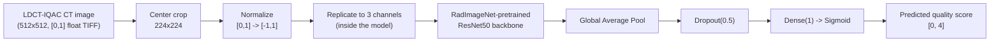
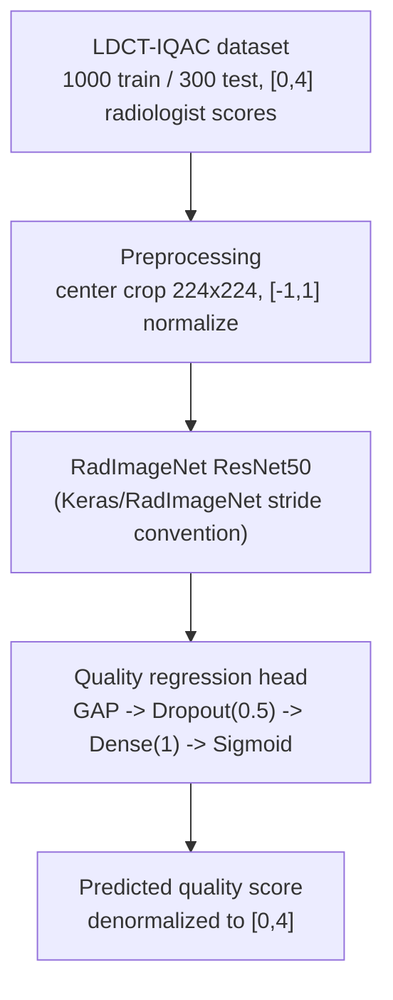
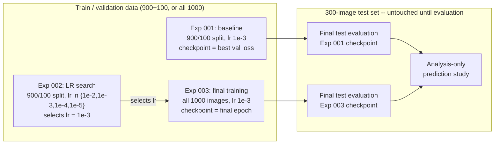
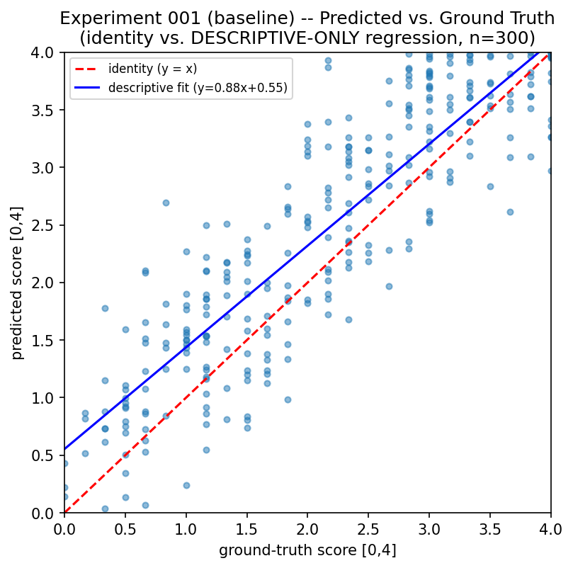
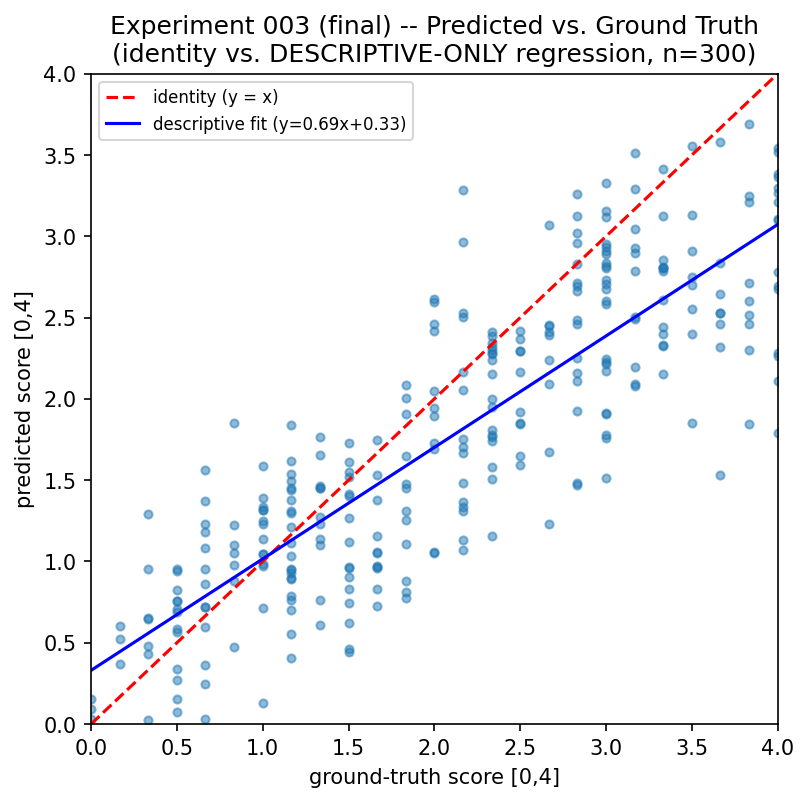
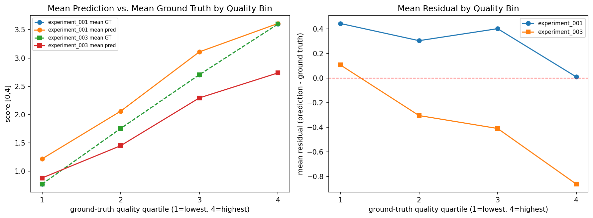
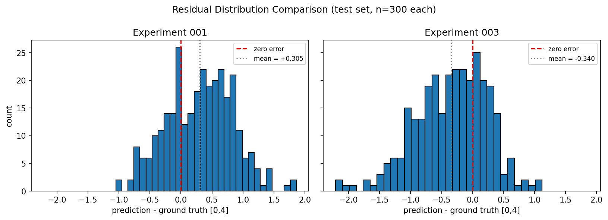
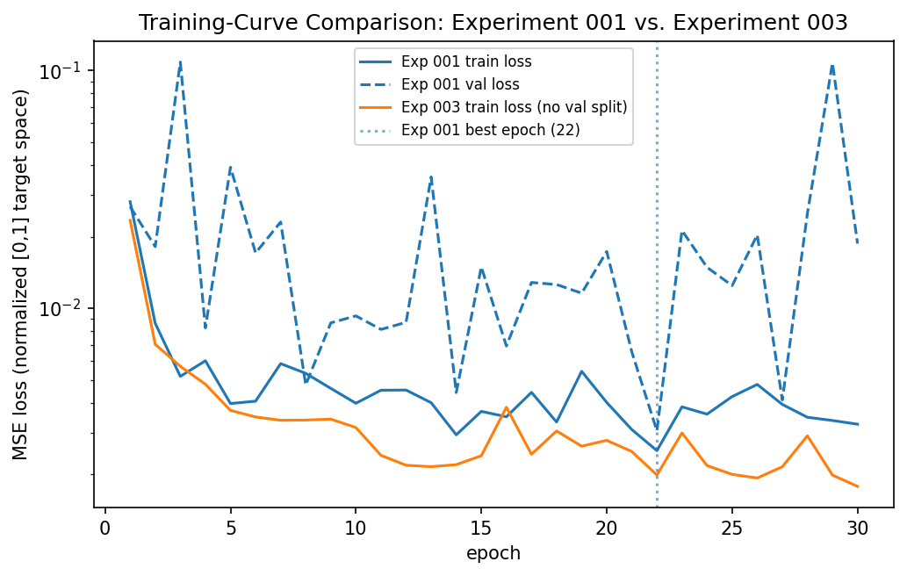

# Quality-Aware Lung CT

**No-reference CT image quality assessment, adapted from Ohashi et al. to the LDCT-IQAC dataset.**


This repository implements and trains a deep-learning model that predicts a
CT image's quality **without needing a clean reference image to compare
against** ("no-reference" IQA). It adapts the ResNet50 baseline from Ohashi
et al. to a dataset with real radiologist-assigned quality labels, and
reports every result from an **independent, held-out test set** that no
training decision ever touched.

> **This project adapts the methodology proposed by Ohashi et al. for
> no-reference CT image quality assessment to the LDCT-IQAC dataset,
> replacing the paper's synthetic degradation/VIF supervision with real
> radiologist-derived quality scores.** It is not a claim of exact
> numerical reproduction -- see [Research positioning](#research-positioning).



---

## Contents

- [Overview](#overview)
- [Research context](#research-context)
- [Key results](#key-results)
- [Methodology](#methodology)
- [Architecture](#architecture)
- [Experimental protocol](#experimental-protocol)
- [Results & analysis](#results--analysis)
- [Repository structure](#repository-structure)
- [Installation](#installation)
- [Usage](#usage)
- [Reproducibility](#reproducibility)
- [Limitations](#limitations)
- [Research positioning](#research-positioning)
- [Citation](#citation)
- [License](#license)

---

## Overview

**PYTHON = implementation, NOTEBOOKS = training + experiments.** All
reusable code (model architecture, data loading, preprocessing, training
loop, evaluation metrics) lives in `src/ct_iqa/`. Notebooks under
`notebooks/` only configure and run that code -- they never redefine it.
Every notebook that produces a scientific artifact is generated from a
`tools/build_*_notebook.py` script, which is the authoritative source; the
`.ipynb` files themselves are never hand-edited.

**Research objective:** reproduce a specific, well-defined no-reference
CT-IQA baseline (ResNet50 + RadImageNet pretraining + a lightweight
regression head) as a foundation for further quality-aware CT work, while
being explicit and honest about every point where this project's dataset,
weight availability, or unspecified paper details required a deliberate
choice.

## Research context

> Ohashi et al., *"Development of a No-Reference CT Image Quality
> Assessment Method Using RadImageNet Pre-trained Deep Learning Models."*

Only the paper's **ResNet50** baseline is replicated here; the paper's
InceptionResNetV2 variant and any further methodology are out of scope.
See [`docs/paper/`](docs/paper/) for what the paper specifies, in detail,
and [`docs/replication/`](docs/replication/) for this project's own
adaptation, deviations, and reproducibility record.

This project trains and evaluates on **LDCT-IQAC**, not the reference
paper's own dataset. LDCT-IQAC provides 1000 training / 300 test CT
images (TIFF, single-channel float, 512x512) each with a
**radiologist-assigned quality score** in `[0, 4]`. See
[`docs/replication/dataset_adaptation.md`](docs/replication/dataset_adaptation.md)
for the full comparison against the paper's own dataset -- **the two are
not the same, and are never treated as interchangeable anywhere in this
codebase or its documentation.**

| | Paper (Ohashi et al.) | This project |
|---|---|---|
| Backbone | ResNet50 or InceptionResNetV2 | ResNet50 only |
| Pretraining | RadImageNet | RadImageNet (verified loaded -- see [Installation](#installation)) |
| Regression target | VIF (from synthetic degradation) | LDCT-IQAC radiologist quality score |
| Degradation pipeline | Synthetic (noise/blur) | None -- not needed, see [Limitations](#limitations) |
| Training config | Adam, MSE, batch 64, 30 epochs, lr 1e-3 | Same |
| Evaluation | PLCC / SROCC / KROCC, 5PL-mapped | Same raw metrics; 5PL calibration deferred (no non-test protocol established) |

Full detail, including every specific deviation and why, is in
[`docs/replication/deviations.md`](docs/replication/deviations.md).

## Key results

All numbers below are measured on the **same, untouched 300-image
LDCT-IQAC test set**, evaluated exactly once per model, from a checkpoint
reloaded fresh in an independent process. Raw (uncalibrated) metrics --
no 5-parameter-logistic mapping is applied, since no non-test calibration
protocol has been established (see
[`docs/replication/final_results.md`](docs/replication/final_results.md)).

**Best independent-test performance: PLCC 0.8804, SROCC 0.8793** (Experiment 001).

| Metric | Experiment 001 (baseline) | Experiment 003 (final) |
|---|---|---|
| PLCC | **0.8804** | 0.8490 |
| SROCC | **0.8793** | 0.8525 |
| KROCC | **0.6952** | 0.6611 |
| MSE | **0.3765** | 0.4474 |
| MAE | **0.5024** | 0.5195 |
| RMSE | **0.6136** | 0.6689 |

Experiment 001 (900/1000 training images, validation-selected checkpoint)
outperforms Experiment 003 (all 1000 training images, unconditional
final-epoch checkpoint) on every metric above. This is a genuine,
measured finding of this project -- not a defect in the presentation --
and it is investigated in detail in
[`docs/replication/final_results.md`](docs/replication/final_results.md)
and [`notebooks/04_evaluation/02_prediction_analysis.ipynb`](notebooks/04_evaluation/02_prediction_analysis.ipynb).
Machine-readable: [`results/tables/final_results_summary.csv`](results/tables/final_results_summary.csv).

These are **not** compared numerically against the Ohashi paper's own
reported values -- different dataset, different label semantics (see
[Research context](#research-context)).

## Methodology



## Architecture

**PAPER FACT:** ResNet50 backbone, 224x224 input, RadImageNet pretraining,
classification head replaced by `Dropout -> Dense(1) -> Sigmoid`.

**OUR IMPLEMENTATION** (`src/ct_iqa/models/`):

- `resnet50.py` -- a from-scratch standard ResNet50 backbone
  (`torchvision` is not used), with stride-2 downsampling placed on the
  1x1 reduce conv (Keras/RadImageNet convention, not torchvision's), so
  RadImageNet's Keras-trained weights map onto it correctly.
- `ohashi_resnet50.py` -- `OhashiResNet50`: the backbone above + the
  Ohashi regression head, plus RadImageNet weight loading
  (`load_radimagenet_weights`).
- `radimagenet_weights.py` -- Keras `.h5` -> PyTorch state-dict conversion
  for RadImageNet weights (runnable as
  `python -m ct_iqa.models.radimagenet_weights`).

**All architecture lives in `src/ct_iqa/models/` and nowhere else.**
Notebooks only ever do `from ct_iqa.models.ohashi_resnet50 import
OhashiResNet50; model = OhashiResNet50(...)`.

## Experimental protocol

**IMPLEMENTATION DECISION**, not prescribed verbatim by the paper: a
multi-stage validation-driven LR search, followed by a final retrain on
all labeled data, followed by one independent test evaluation.



| Stage | Training data | Learning rate | Epochs | Checkpoint selection |
|---|---|---|---|---|
| Experiment 001 (baseline) | 900/1000 (100 held out) | 1e-3 (paper default) | 30 | lowest validation loss (epoch 21) |
| Experiment 002 (LR search) | 900/1000 (same split) | {1e-2, 1e-3, 1e-4, 1e-5} | 30 each | validation loss, per run |
| Experiment 003 (final) | 1000/1000 (all) | 1e-3 (selected by exp. 002) | 30 | unconditional final epoch (30) |

The 300-image test set was loaded exactly twice -- once per checkpoint
(experiments 001 and 003) -- and never during training or LR selection.
See [`docs/replication/reproducibility.md`](docs/replication/reproducibility.md)
for the full contamination-check record.

## Results & analysis

Predicted vs. ground-truth quality, on the untouched test set (identity
line vs. a **descriptive-only** linear fit -- never used to recalibrate
either model):

| Experiment 001 | Experiment 003 |
|---|---|
|  |  |

Mean prediction and mean error by ground-truth quality quartile (both
experiments) -- Experiment 001 overpredicts across all quartiles;
Experiment 003 underpredicts increasingly at higher quality:



Residual distributions and training curves:

| Residuals (both experiments) | Training curves (both experiments) |
|---|---|
|  |  |

Further diagnostics -- prediction distributions, error-vs-quality plots,
top-error qualitative examples, the full experiment-001-vs-003
investigation (labeled **OBSERVED** / **PLAUSIBLE HYPOTHESIS** / **NOT
DETERMINED**), and the calibration-status assessment -- are in:

- [`docs/replication/final_results.md`](docs/replication/final_results.md) -- the full written analysis.
- [`notebooks/04_evaluation/02_prediction_analysis.ipynb`](notebooks/04_evaluation/02_prediction_analysis.ipynb) -- the executable analysis (analysis-only: no retraining, no re-evaluation, no test-set calibration fitting).
- [`results/`](results/) -- every figure, table, prediction CSV, and metrics JSON referenced above and in the linked documents.

## Repository structure

```
├── README.md, pyproject.toml, .gitignore, .python-version
├── configs/            YAML hyperparameters (dataset/preprocessing/model/training)
├── data/
│   ├── raw/ldct_iqac/  original CT images (gitignored; see Installation)
│   ├── labels/ldct_iqac/  filename -> quality-score JSON (tracked)
│   └── interim/, processed/  currently unused (no precompute step exists)
├── docs/
│   ├── paper/          what the paper specifies, ONLY
│   ├── replication/    our adaptation, deviations, reproducibility, final results
│   └── decisions/      repository/process decisions log
├── src/ct_iqa/         all reusable implementation (models, data, training, evaluation)
├── notebooks/          research execution: 01_exploration -> 02_data_preparation
│                       -> 03_training -> 04_evaluation
├── tools/               notebook-generator scripts (dev tooling; authoritative source for notebooks)
├── weights/pretrained/  externally-sourced pretrained weights (gitignored)
├── experiments/         per-run checkpoints + config (gitignored binaries)
├── results/             evaluation outputs: figures/tables/predictions/metrics
└── tests/unit/, tests/integration/
```

See [`docs/repository_architecture_audit.md`](docs/repository_architecture_audit.md)
for the full audit this structure was migrated from, file by file.

## Installation

```bash
git clone <this repository>
cd quality-aware-lung-ct

# using uv (recommended -- resolves and pins the exact environment)
uv sync --extra dev

# or with plain pip
pip install -e .          # installs `ct_iqa` so notebooks can `import ct_iqa`
pip install -e ".[dev]"   # + pytest, nbformat, for running tests/regenerating notebooks
```

Requires Python >= 3.10 (developed against 3.10; see `.python-version`).

**Dataset setup.** This repository does **not** include the LDCT-IQAC
images (patient-derived CT data). To run anything beyond `pytest`'s
synthetic-data unit tests, place the dataset at:

```
data/raw/ldct_iqac/train/image/*.tif     (1000 files)
data/raw/ldct_iqac/test/images/*.tiff    (300 files)
```

`data/labels/ldct_iqac/train.json` and `test.json` (filename -> quality
score) are already included in this repository (they contain no pixel
data). Paths are configured in `configs/dataset.yaml`.

**Pretrained weights setup.** RadImageNet weights are not bundled (large,
and not this project's to redistribute). See
[`weights/pretrained/radimagenet/resnet50/README.md`](weights/pretrained/radimagenet/resnet50/README.md)
for the full source/conversion/verification writeup. Summary:

1. Obtain `RadImageNet-ResNet50_notop.h5` from
   [BMEII-AI/RadImageNet](https://github.com/BMEII-AI/RadImageNet) (access
   requested via their form) and place it at
   `weights/pretrained/radimagenet/resnet50/RadImageNet-ResNet50_notop.h5`.
2. Convert it: `python -m ct_iqa.models.radimagenet_weights`.
3. Point `configs/model.yaml`'s `radimagenet_weights_path` at the resulting
   `.pt` file (already configured for this repository's own runs).

Weight *loading* has been verified against the converted file
(265/318 backbone keys matched, 0 unexpected -- see the README linked
above) and used to initialize both experiments 001 and 003, whose test
results appear in [Key results](#key-results).

## Usage

**Training.** `notebooks/03_training/01_resnet50_baseline.ipynb`
(generated by `tools/build_training_notebook.py`) loads `ExperimentConfig`
from `configs/*.yaml`, builds the dataset/model, runs a 2-batch smoke test
(forward/backward/`optimizer.step()`, then restores pre-smoke-test
weights), and runs the training loop (`ct_iqa.training.trainer.train`) --
gated behind a `RUN_FULL_TRAINING` flag so re-running the notebook doesn't
silently trigger a long run. `02_learning_rate_search.ipynb` and
`03_final_training.ipynb` follow the same pattern for experiments 002 and
003 respectively.

**Evaluation.** `notebooks/04_evaluation/01_test_set_evaluation.ipynb`
(generated by `tools/build_evaluation_notebook.py`) is independent of any
training notebook -- it loads a checkpoint from disk into a fresh model
instance, evaluates once on the held-out LDCT-IQAC test set, and writes
predictions/metrics/figures to `results/`.

**Analysis.** `notebooks/04_evaluation/02_prediction_analysis.ipynb`
(generated by `tools/build_prediction_analysis_notebook.py`) reads the
already-generated prediction CSVs and training histories -- no checkpoint
is reloaded, no inference is re-run, no test-set calibration is fit. This
produces the comparison tables and figures linked in
[Results & analysis](#results--analysis).

Never hand-edit a generated `.ipynb` as the primary way of changing it --
edit the corresponding `tools/build_*.py` generator and re-run it (e.g.
`uv run python tools/build_evaluation_notebook.py`), then re-execute the
notebook from a clean process (e.g.
`uv run jupyter execute notebooks/04_evaluation/01_test_set_evaluation.ipynb --output=01_test_set_evaluation.ipynb`).

## Reproducibility

See [`docs/replication/reproducibility.md`](docs/replication/reproducibility.md)
for seeding, the train/validation split, and configuration provenance.
Summary: `ct_iqa.utils.seed.set_seed(config.seed)` seeds Python/NumPy/
PyTorch; the validation split is a seeded `random_split`; every experiment
run saves its resolved config alongside its checkpoint
(`experiments/<NNN_name>/config.json`); every checkpoint referenced in
this README was independently reloaded into a fresh model instance/
process and evaluated with `model.eval()`/`torch.no_grad()` before its
numbers were reported.

**Current status: complete.** `001_resnet50_baseline` ->
`002_learning_rate_search` -> `003_final_training` -> final independent
test-set evaluation -> analysis-only prediction study -- all stages
executed and persisted, per [Experimental protocol](#experimental-protocol).

## Limitations

- Only the ResNet50 baseline is implemented; no InceptionResNetV2, no
  further architectural novelty.
- Results on LDCT-IQAC are **not directly comparable** to the paper's own
  reported numbers (different dataset, different label semantics -- see
  [Research context](#research-context)).
- The Dropout probability (`configs/model.yaml`: `0.5`) is this project's
  choice, not a value taken from the paper (the paper does not specify
  one).
- No data augmentation, learning-rate scheduling, or early stopping is
  implemented for the baseline configuration (deliberately, to stay close
  to the paper's stated training setup).
- No calibration (5PL or otherwise) protocol has been validated on
  non-test data; only raw metrics are reported for both experiments (see
  [`docs/replication/final_results.md`](docs/replication/final_results.md)).
- The final (experiment 003) model performed empirically worse than the
  validation-selected baseline (experiment 001) on the test set, with an
  opposite-signed prediction bias -- the cause is not fully determined by
  the available data (checkpoint-selection method and training-set size
  are both plausible, uncontrolled-for factors); see
  [`docs/replication/final_results.md`](docs/replication/final_results.md)
  for the full "observed / hypothesis / not determined" breakdown.
- No statistical significance testing is implemented anywhere in this
  project's evaluation code -- all comparisons reported are descriptive.

## Research positioning

This is an **Ohashi-style RadImageNet ResNet50 CT-IQA model adapted to
LDCT-IQAC** -- not an exact reproduction of the original paper. The paper
regresses a **VIF** score computed from synthetically-degraded images on
its own dataset; this project regresses **LDCT-IQAC's real
radiologist-assigned quality score** on real, naturally quality-varying
CT images. Both the dataset and the regression target differ from the
paper by deliberate, documented choice (see
[`docs/replication/dataset_adaptation.md`](docs/replication/dataset_adaptation.md)
and [`docs/replication/deviations.md`](docs/replication/deviations.md)),
so this project's PLCC/SROCC/KROCC numbers are never presented as
equivalent to, or a benchmark against, the paper's own reported values.

Every number in [Key results](#key-results) comes from a single pass of
inference over the same **independent, held-out 300-image test set**,
using a checkpoint reloaded fresh in its own process, with no calibration
or parameter fit on that test set. This project does not claim
state-of-the-art performance, clinical usefulness, or that RadImageNet
pretraining is universally superior to ImageNet pretraining -- see
[Limitations](#limitations) for what is, and is not, supported by the
evidence collected here.

## Citation

If you build on the methodology this project adapts, cite the reference
paper:

> Ohashi et al., *"Development of a No-Reference CT Image Quality
> Assessment Method Using RadImageNet Pre-trained Deep Learning Models."*
> (Full bibliographic details -- venue, year, DOI -- have not been
> independently verified against the primary source within this
> repository and are intentionally omitted rather than guessed; see
> [`docs/paper/paper_summary.md`](docs/paper/paper_summary.md).)

If you use the dataset, cite **LDCT-IQAC** (see
[`docs/replication/dataset_adaptation.md`](docs/replication/dataset_adaptation.md)
for how it is used in this project; this repository does not redistribute
the dataset itself).

## License

**Undetermined.** No `LICENSE` file exists in this repository. The
correct license depends on a decision only the project owner can make
(and interacts with the usage terms of both LDCT-IQAC and RadImageNet) --
see [`docs/decisions/README.md`](docs/decisions/README.md). Until a
`LICENSE` file is added, no license should be assumed.
