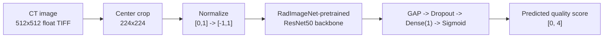

# Quality-Aware Lung CT

**No-reference CT image quality assessment**, adapted from Ohashi et al.
to the LDCT-IQAC dataset.


## What this is

This project trains a deep-learning model that scores a CT image's
quality **without needing a clean reference image to compare against**
("no-reference" image quality assessment). It adapts the ResNet50
baseline from Ohashi et al., *"Development of a No-Reference CT Image
Quality Assessment Method Using RadImageNet Pre-trained Deep Learning
Models,"* to the **LDCT-IQAC** dataset, which has real
radiologist-assigned quality labels instead of the paper's synthetic
degradation setup.



This is an adaptation, not an exact reproduction — the dataset and
regression target both differ from the original paper. See
[Research context](#research-context) for what that means for the
numbers below.

## Results

Measured once per model on the same untouched 300-image LDCT-IQAC test
set, from a checkpoint reloaded in a fresh process (raw metrics, no
calibration):

| Metric | Experiment 001 (baseline) | Experiment 003 (final) |
|---|---|---|
| PLCC | **0.8667** | 0.8490 |
| SROCC | **0.8699** | 0.8525 |
| KROCC | **0.6816** | 0.6611 |
| MAE | **0.4815** | 0.5195 |
| RMSE | **0.5736** | 0.6689 |

Experiment 001's checkpoint is selected by the best validation-set PLCC
seen during training (`checkpoint_type="best_plcc"`), not by validation
loss — see [`docs/internal/decisions/README.md`](docs/internal/decisions/README.md)
for why this matters and [`docs/paper/training.md`](docs/paper/training.md)
for why it's an implementation decision, not a paper-specified detail.
Under this selection rule, the validation-selected baseline (001) still
outperforms the final full-data model (003) on every metric above — a
genuine finding, investigated in
[`docs/replication/final_results.md`](docs/replication/final_results.md).
These numbers are **not** compared against the original paper's reported
values (different dataset, different label semantics — see
[Research context](#research-context)).

## Quickstart

### 1. Install

```bash
git clone <this-repository-url>
cd Deep-Learning-for-CT-Image-Quality-Assessment

# with uv (recommended)
uv sync --extra dev

# or with plain pip
pip install -e ".[dev]"
```

Requires Python >= 3.10 (see `.python-version`). `[dev]` pulls in
`pytest`, `nbformat`, `ipykernel`, `nbclient`, and `pandas` — everything
needed to run the test suite and regenerate/execute notebooks.

### 2. Get the data

**LDCT-IQAC is a private dataset and is not included or redistributed by
this repository.** Only the derived label files
(`data/labels/ldct_iqac/{train,test}.json` — filename → quality score,
no pixel data) are tracked in git.

To run anything beyond the synthetic-data unit tests, place the raw
images at:

```
data/raw/ldct_iqac/train/image/*.tif     (1000 files)
data/raw/ldct_iqac/test/images/*.tiff    (300 files)
```

Paths are configured in `configs/dataset.yaml`.

### 3. Get the pretrained weights

RadImageNet weights are not bundled. Full instructions:
[`weights/pretrained/radimagenet/resnet50/README.md`](weights/pretrained/radimagenet/resnet50/README.md).
Short version:

```bash
# 1. Obtain RadImageNet-ResNet50_notop.h5 from BMEII-AI/RadImageNet
#    (https://github.com/BMEII-AI/RadImageNet, access requested via their form)
#    and place it at:
#    weights/pretrained/radimagenet/resnet50/RadImageNet-ResNet50_notop.h5

# 2. Convert it to a PyTorch checkpoint
python -m ct_iqa.models.radimagenet_weights

# 3. configs/model.yaml already points radimagenet_weights_path at the
#    resulting .pt file
```

### 4. Run it

All reusable code lives in `src/ct_iqa/`; notebooks under `notebooks/`
only configure and run it. Each notebook is generated from a script in
`tools/` — edit the generator, not the `.ipynb`, then re-run both
commands below to regenerate and re-execute it:

| Stage | Generator | Notebook |
|---|---|---|
| Explore the dataset | `tools/build_eda_notebook.py` | `notebooks/01_exploration/01_dataset_eda.ipynb` |
| Prepare data splits | `tools/build_dataset_preparation_notebook.py` | `notebooks/02_data_preparation/01_dataset_preparation.ipynb` |
| Train baseline | `tools/build_training_notebook.py` | `notebooks/03_training/01_resnet50_baseline.ipynb` |
| Learning-rate search | `tools/build_lr_search_notebook.py` | `notebooks/03_training/02_learning_rate_search.ipynb` |
| Final training | `tools/build_final_training_notebook.py` | `notebooks/03_training/03_final_training.ipynb` |
| Baseline (001) test-set evaluation | `tools/evaluate_baseline_test_set.py` (plain script, not a notebook — see its module docstring) | writes `results/metrics/001_resnet50_baseline_test_metrics.json` directly |
| Final (003) test-set evaluation | `tools/build_evaluation_notebook.py` | `notebooks/04_evaluation/01_test_set_evaluation.ipynb` |
| Prediction analysis | `tools/build_prediction_analysis_notebook.py` | `notebooks/04_evaluation/02_prediction_analysis.ipynb` |

Example, for the baseline training notebook:

```bash
# regenerate the notebook from its generator script
uv run python tools/build_training_notebook.py

# execute it end-to-end in a clean process
uv run jupyter execute notebooks/03_training/01_resnet50_baseline.ipynb \
    --output=01_resnet50_baseline.ipynb
```

Training notebooks are gated behind a `RUN_FULL_TRAINING` flag so
re-running them doesn't silently trigger a long run. Evaluation and
analysis notebooks are independent of any training notebook — they load
a checkpoint from disk and write results to `results/`.

Reproduce experiment 001's test-set metrics directly (no notebook step):

```bash
uv run python tools/evaluate_baseline_test_set.py
```

Run the test suite with:

```bash
uv run pytest
```

## Project layout

```
├── configs/            YAML hyperparameters (dataset/preprocessing/model/training)
├── data/
│   ├── raw/ldct_iqac/  raw CT images (gitignored — see Quickstart)
│   ├── labels/ldct_iqac/  filename -> quality-score JSON (tracked)
│   └── interim/, processed/  currently unused
├── docs/
│   ├── paper/          what the reference paper specifies
│   ├── replication/    this project's adaptation, deviations, and results
│   └── internal/       engineering/process history, not needed to use the project
├── src/ct_iqa/         all reusable implementation (models, data, training, evaluation)
├── notebooks/          research execution: 01_exploration -> 02_data_preparation
│                       -> 03_training -> 04_evaluation
├── tools/              notebook-generator scripts (authoritative source for notebooks)
├── weights/pretrained/  externally-sourced pretrained weights (gitignored)
├── experiments/         per-run checkpoints + config (gitignored binaries)
├── results/             evaluation outputs: figures/tables/predictions/metrics
└── tests/unit/, tests/integration/
```

## Documentation map

- [`docs/paper/`](docs/paper/) — architecture, preprocessing, training,
  and evaluation exactly as the Ohashi et al. paper specifies them.
- [`docs/replication/`](docs/replication/) — how this project adapts that
  methodology: dataset differences
  ([`dataset_adaptation.md`](docs/replication/dataset_adaptation.md)),
  every deliberate deviation
  ([`deviations.md`](docs/replication/deviations.md)), seeding/split/
  reproducibility details
  ([`reproducibility.md`](docs/replication/reproducibility.md)), and the
  full results writeup
  ([`final_results.md`](docs/replication/final_results.md)).
- [`docs/internal/`](docs/internal/) — repository engineering history.
  Not needed to install, run, or understand the project.
- [`weights/pretrained/radimagenet/resnet50/README.md`](weights/pretrained/radimagenet/resnet50/README.md)
  — pretrained weight source, conversion, and verification.
- `experiments/*/README.md` — per-run training/evaluation record.

## Research context

Only the paper's ResNet50 baseline is replicated (not its
InceptionResNetV2 variant), and it's trained on a different dataset with
a different regression target:

| | Paper (Ohashi et al.) | This project |
|---|---|---|
| Backbone | ResNet50 or InceptionResNetV2 | ResNet50 only |
| Pretraining | RadImageNet | RadImageNet (verified loaded) |
| Regression target | VIF (from synthetic degradation) | LDCT-IQAC radiologist quality score |
| Degradation pipeline | Synthetic (noise/blur) | None — not needed |
| Training config | Adam, MSE, batch 64, 30 epochs, lr 1e-3 | Same |
| Evaluation | PLCC / SROCC / KROCC, 5PL-mapped | Same raw metrics; 5PL calibration deferred |

Full detail: [`docs/replication/dataset_adaptation.md`](docs/replication/dataset_adaptation.md)
and [`docs/replication/deviations.md`](docs/replication/deviations.md).

## Limitations

- Only the ResNet50 baseline is implemented — no InceptionResNetV2.
- Results are not directly comparable to the paper's own reported
  numbers (different dataset, different label semantics).
- Dropout probability (0.5) is this project's own choice; the paper
  doesn't specify one.
- No data augmentation, LR scheduling, weight decay, or warmup
  (deliberately, to stay close to the paper's stated training setup) —
  but checkpoint selection **is** a validation-based model-selection step
  (see `docs/paper/training.md`), not something the paper's fixed-epoch
  configuration calls for.
- No non-test calibration protocol exists yet, so only raw metrics are
  reported.
- The final full-data model (003) performs worse than the
  validation-selected baseline (001) on the test set; the cause isn't
  fully determined — see
  [`docs/replication/final_results.md`](docs/replication/final_results.md).
- No statistical significance testing is implemented; all comparisons
  are descriptive.

## License

This repository's **code** (`src/ct_iqa/`, `tools/`, `notebooks/`,
`configs/`) is MIT-licensed — see [`LICENSE`](LICENSE). It does **not**
cover the LDCT-IQAC dataset or RadImageNet pretrained weights, both of
which remain under their own original terms and are not redistributed
here.
